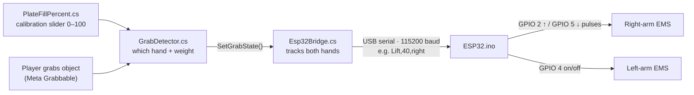

<div align="center">

# 🦾 Phantom Weight

### A VR haptic wearable that makes virtual objects *feel* heavy

<p>
  
  
  
  
  
  
</p>

**UMD CSPE** · Team **noobifyLol** · **Mid** · **datncode**

[Getting Started](#-getting-started) · [Controls](#-controls) · [How It Works](#-how-it-works) · [Scripts](#-scripts) · [🐛 Error Log](docs/ERROR_LOG.md) · [History](#-project-history)

</div>

---

## 📖 About

Phantom Weight pairs a **Meta Quest 3** VR scene with an **ESP32**-driven EMS (electrical muscle stimulation) wearable. When you pick up an object in VR, Unity works out which hand grabbed it and how heavy it should feel, then tells the ESP32 over serial. The ESP32 drives the EMS units on your arms, so heavier objects give a stronger response. A calibration slider in the scene, based on the [personal weight formula](#%EF%B8%8F-personal-weight-formula), sets the base weight.

---

## 📑 Contents

- [🔧 To-Do](#-to-do)
- [⚖️ Personal Weight Formula](#%EF%B8%8F-personal-weight-formula)
- [🧱 Repository Layout](#-repository-layout)
- [🚀 Getting Started](#-getting-started)
- [🎮 Controls](#-controls)
- [🛠️ Building the Scene](#%EF%B8%8F-building-the-scene)
- [🔌 How It Works](#-how-it-works)
- [📜 Scripts](#-scripts)
- [✨ Features](#-features)
- [🐛 Troubleshooting](#-troubleshooting)
- [📈 Project History](#-project-history)
- [🗂️ Version Control](#%EF%B8%8F-version-control)

---

## 🔧 To-Do

- [ ] **Connect the ESP32 wirelessly** — not started yet. *(`Assets/Scripts/main.cpp.txt` is an old wired draft, not a Bluetooth version — flash `Firmware/ESP32/ESP32.ino`.)*
- [ ] **Add a body** so you see one when you look down — `FeetFollower.cs` is the start of this (walk animation not wired up yet).
- [ ] **Make held items move slower in hand** — damping was raised on some grabbables on 9/12; tune the rest.
- [ ] **Make other objects grabbable** — see [Making an object grabbable](#making-an-object-grabbable).
- [ ] **Fix the skateboard issue.**
- [ ] **Fix grabbing** — objects transforming/dilating when held.
- [ ] **Pick one OpenXR package settings asset** — there are two (see [Error Log → Open Issues](docs/ERROR_LOG.md#-open-issues)).
- [ ] **Re-add scene objects lost in the 9/12 merge if still wanted** — `Dumbbell` prefab, `Garage` prefab, `Directional Light`.

---

## ⚖️ Personal Weight Formula

<p align="center">
  
</p>

---

## 🧱 Repository Layout

```text
UMD CSPE/
├── Assets/
│   ├── Scenes/UMD CSPE.unity        ← main scene
│   ├── Scripts/                     ← all gameplay / hardware scripts (see Scripts)
│   ├── physicsMaterials/            ← softMaterial.physicMaterial for squishy grabbables
│   ├── XR/                          ← OpenXR + XR Plug-in Management settings
│   └── (asset packs)                ← Brick Project Studio, Street Assets, Simple Garage,
│                                      AllSkyFree, Mnostva Art café, office items…
├── Firmware/ESP32/ESP32.ino         ← Arduino sketch for the wearable (flash this)
├── Packages/                        ← manifest + locally embedded packages
├── ProjectSettings/
└── docs/ERROR_LOG.md                ← every error we hit and how we fixed it
```

---

## 🚀 Getting Started

### Requirements

| What | Version / notes |
|---|---|
| Unity | **6000.5.4f1** with **Android Build Support** (see `ProjectSettings/ProjectVersion.txt`) |
| Headset | Meta Quest 3 (+ Quest Link cable for Play-in-Editor) |
| Microcontroller | ESP32 + EMS units, USB cable |
| Arduino | Arduino IDE (or `arduino-cli`) with the ESP32 board package |
| Git | **Git LFS** — textures, models, audio and binaries are stored in LFS |

### Setup

1. **Clone with LFS**
   ```bash
   git lfs install
   ```
   ```bash
   git clone https://github.com/noobifyLol/Phantom_Weight_Cyber_Systems.git
   ```
2. **Open the project** in Unity Hub with 6000.5.4f1, then open `Assets/Scenes/UMD CSPE.unity`.
   > 📶 **On campus Wi-Fi?** Log in to the Wi-Fi page in a browser *before* opening Unity, or Package Manager can't download packages.
3. **Flash the ESP32** — open `Firmware/ESP32/ESP32.ino`, select your ESP32 board and port, upload. The Serial Monitor should print `Wired ESP32 Connection Ready!` — then **close the Serial Monitor** so Unity can use the port.
4. **Set the COM port** — in `Assets/Scripts/Esp32Bridge.cs`, set `PortName` (currently `"COM9"`) to your ESP32's port from **Device Manager → Ports (COM & LPT)**.
5. **Press Play** with the Quest connected over Link. The Console shows `[Esp32Bridge] Connected on COMx.` on the first grab.

> ⚠️ The serial connection only works **in the Editor and Windows builds**. `System.IO.Ports` doesn't exist on Android, so on-device Quest builds run without the wearable.

**Building for Quest:** File → Build Profiles → Android, architecture **ARM64**, with `UMD CSPE` in the scene list.

---

## 🎮 Controls

| Input | Action |
|---|---|
| Left stick | Move |
| Right stick ← / → | Smooth or snap turn |
| Right stick ↓ | Crouch |
| Hold **both grips** + swing arms | Run (hand tracking: swing harder, no grips needed) |
| **A** | Jump (only when on the ground) |
| **B** | Raise view height by 0.5 m |
| **X** | Lower view height by 0.5 m |
| Trigger / grip on an object | Grab — sends the weight to the wearable |
| Real-life walking / crouching | Amplified by Physical Move Gain and Physical Height Gain |

---

## 🛠️ Building the Scene

### Setting up the player

1. Install the Meta All-In-One SDK to get Meta Building Blocks.
2. Drag the camera rig into your environment and connect the camera and controllers.
3. Add `CompleteVRLocomotion.cs` to the camera rig so the player can move.
4. Add `[BuildingBlock] OVRComprehensiveInteractionRig` to show hand and controller models together (it handles the blend between them).
5. Add cubes or imported assets and attach the Meta **Grabbable** block to them.
6. On each grabbable, add `GrabDetector` next to `Grabbable` so it can detect grabs and talk to the ESP32.
7. For objects that should feel soft, assign `Assets/physicsMaterials/softMaterial.physicMaterial` to the Collider.

### Making an object grabbable

1. With Meta Building Blocks, add `[BuildingBlock] HandGrabInstallationRoutine` to the object.
2. On the **object itself**, add: `Grab Interactable`, `Box Collider`, `Grabbable`, `Rigidbody`, `Grab Detector`, `Grab Free Transformer`, `Interactable Trigger Broadcaster`.
3. Inside **`HandGrabInstallationRoutine`**, add: `Hand Grab Interactable`, `Grab Interactable`, `Move Towards Target Provider`.
4. On the object, drag `Grab Free Transformer` into **both** optional transformer slots of `Grabbable` (One Grab and Two Grab Transformer).
5. In `HandGrabInstallationRoutine` → `Hand Grab Interactable`: drag the object's `Grabbable` into **Pointable Element** and its `Rigidbody` into **Rigidbody**.
6. In `HandGrabInstallationRoutine` → `Grab Interactable`: same again — `Grabbable` into **Pointable Element**, `Rigidbody` into **Rigidbody**.

> 💡 **Collider rules:** use a `BoxCollider`, or tick **Convex** on a `MeshCollider`. A non-convex MeshCollider on a moving Rigidbody falls through the floor. Don't put the `Player` layer in the Rigidbody's **Exclude Layers**, or the hands can't grab it.
>
> 🎚️ **Tuning feel:** raise the Rigidbody's **Linear/Angular Damping** to make it move slower in hand, and set `GrabDetector` → **multiper** (0–2) to make it feel lighter or heavier than the slider.

---

## 🔌 How It Works



1. **Grab** — `GrabDetector` hears the grab event, finds the closest hand, and calculates `weight = Clamp(Round(slider % × multiper), 0, 100)`. While held, the object's collider becomes a trigger so it can't shove the player.
2. **Bridge** — `Esp32Bridge.SetGrabState(hand, grabbing, weight)` updates that hand's state and sends the **combined** state of both hands, so a quick drop/re-grab or passing an object between hands never gets out of sync.
3. **Firmware** — the ESP32 parses the line and drives the EMS channels.

### Serial protocol

One line per state change, `Command,Weight,Hand`:

| Hands holding | Unity sends |
|---|---|
| Both | `Lift,{heavier weight},both` |
| Left only | `Lift,{weight},left` then `Release,0,right` |
| Right only | `Lift,{weight},right` then `Release,0,left` |
| Neither | `Release,0,both` |
| Quit app / restart Play | `Release,0,both` (kill switch), then the port closes |

### Firmware behavior (`Firmware/ESP32/ESP32.ino`)

| Channel | Pins | On `Lift,w` | On `Release` |
|---|---|---|---|
| Left arm | GPIO 4 | HIGH | LOW |
| Right arm | GPIO 2 (up), GPIO 5 (down) | Pulses up or down from its current level to `w` | Pulses down to 0 |

- Commands and hand names are case-insensitive; `both` drives both channels.
- Each pulse is 67 ms HIGH + 67 ms LOW. The firmware **remembers the right arm's level**, since Unity sends `Release` with weight 0.
- Pulsing blocks the loop (0 → 100 takes about 13 s); new commands queue until it finishes.

---

## 📜 Scripts

| Script | What it does |
|---|---|
| [`CompleteVRLocomotion.cs`](Assets/Scripts/CompleteVRLocomotion.cs) | All player movement: joystick move, arm-swing running, gravity + jump, turning, crouch, Physical Move/Height Gain and B/X height buttons. See [Features](#-features). |
| [`GrabDetector.cs`](Assets/Scripts/GrabDetector.cs) | Goes on every grabbable. Event-driven (`Grabbable.WhenPointerEventRaised`, no per-frame polling). Works out the hand and weight and reports to `Esp32Bridge`. Debug getters: `IsLeftHeld()`, `IsRightHeld()`, `AreBothHeld()`. |
| [`Esp32Bridge.cs`](Assets/Scripts/Esp32Bridge.cs) | Static class that owns the serial port (`PortName`, 115200 baud) and the two-hand grab state. Only this script opens the port, which avoids "port busy" fights. Logs one warning and does nothing if the ESP32 isn't connected. |
| [`PlateFillPercent.cs`](Assets/Scripts/PlateFillPercent.cs) | Turns the calibration slider's position into a 0–100 `percent`. Also draws a floating `NN%` label and a colored fill bar. |
| [`WeightScaleCube.cs`](Assets/Scripts/WeightScaleCube.cs) | Shows the weight visually by scaling a cube from 0.3× to 2.5× as the slider goes 0 → 100. |
| [`FeetFollower.cs`](Assets/Scripts/FeetFollower.cs) | *(WIP body)* Keeps an avatar on the floor under the headset and turns it with your head. Animator fields exist but aren't wired up yet. |
| [`playerPushScript.cs`](Assets/Scripts/playerPushScript.cs) | Gently pushes `Cubes`-layer objects when the player bumps them. Low `stepOffset` so cubes act as walls. |
| [`Billboard.cs`](Assets/Scripts/Billboard.cs) | Makes a label always face the camera. |
| [`PokeLogger.cs`](Assets/Scripts/PokeLogger.cs) | Debug helper for Meta poke events. Hides `DisclaimerCanvas` when poked. |
| [`ESP32.ino`](Firmware/ESP32/ESP32.ino) | Wearable firmware (see [Firmware behavior](#firmware-behavior-firmwareesp32esp32ino)). |
| `main.cpp.txt` | ⚠️ Old firmware draft, kept for reference. **Don't flash it.** |

---

## ✨ Features

<details open>
<summary><b>🏃 Locomotion — <code>CompleteVRLocomotion.cs</code></b></summary>

- **Joystick move**, **smooth or snap turn**, **stick crouch**.
- **Arm-swing running.** Smoothed so it isn't choppy. On controllers it needs **both grips** so a one-handed reach doesn't start a run. With bare hand tracking it uses a higher swing threshold (`minSwingHands`).
- **Gravity + jump (A).** Jump only fires when a sphere check at your feet hits `groundLayer`. Your own layer is excluded, which prevents the old "fly" bug.
- **Physical Move Gain** amplifies real-life steps.
- **Physical Height Gain** amplifies real-life crouching and standing, fading to 1× near the floor so reaching down stays precise.
- **Height buttons.** B/X move the view ±0.5 m, stored in a persistent offset so it doesn't snap back.
- **Fall-recovery safety net** if you drop off the map.

</details>

<details>
<summary><b>🖐️ Grabbing & haptics</b></summary>

- Meta Interaction SDK hand + controller grabbing, with both models blending correctly (`OVRComprehensiveInteractionRig`).
- Held objects become triggers (no pushing the player), and grab transformers limit scaling.
- Soft physics material for squishy objects; per-object damping and `multiper` weight tuning.
- Two-hand-aware ESP32 bridge with a kill switch on quit.

</details>

<details>
<summary><b>🎨 Visuals & performance (Quest 3)</b></summary>

- ACES tonemapping, bloom, color adjustments, SSAO, soft shadows.
- `QuestPerformanceSetup.cs`: 90 Hz, SustainedHigh CPU/GPU, dynamic foveated rendering level 3. Render scale and shadow distance tuned for room-scale VR.
- Scene built from asset packs: Brick Project Studio apartment props, Street Assets, Simple Garage, office items, AllSkyFree skyboxes, Mnostva Art café interior.

</details>

<details>
<summary><b>🧩 Engine setup</b></summary>

- Meta XR SDK 205 from Package Manager. `com.meta.xr.sdk.audio` and `com.unity.ai.navigation` are embedded locally.
- OpenXR for Android (ARM64), XR Plug-in Management configured.
- Git + Git LFS alongside Unity Version Control (Plastic).

</details>

---

## 🐛 Troubleshooting

Every error we've hit, with causes and fixes, is in **[docs/ERROR_LOG.md](docs/ERROR_LOG.md)**. It starts with a quick-fix table, then open issues, harmless warnings and a full dated log.

---

## 📈 Project History

<details>
<summary><b>How we built this, week by week (from the commit log)</b></summary>

Contributors: **noobifyLol** (commits also appear as *Noobifiy*), **Mid**, **datncode**.

### Week 1 — Foundation (7/22–7/23) · *noobifyLol*
- **7/22** — Set up Git + Git LFS and stopped Git and Plastic from tracking each other.
- **7/22** — Fixed blown-out room lighting (`fonas1`, `Furniture_ges1`).
- **7/22** — Forked and patched Meta XR SDK core, interaction and MR Utility Kit to compile on Unity 6000.5.4f1.
- **7/22** — Enabled XR runtime features, built the room into the main scene, swapped in `CameraPlayer`, installed OpenXR for Android.
- **7/23** — Added the Meta Building Blocks XR rig, VR locomotion and grab/haptics blocks.

### Week 2 — GitHub, Quest 3 & ESP32 (7/27–7/30)
- **7/27** *(noobifyLol)* — First commit to GitHub; fixed console errors; Quest 3 optimisation; **first Unity → ESP32 bridge**; visual realism pass.
- **7/28** *(Mid)* — Fixed the hand/controller blend and black blur; fixed trigger colliders and zero-gravity jump; added crouch scaling and fall recovery.
- **7/28** *(datncode)* — Fixed the hands-and-controller glitch.
- **7/29** — datncode: fixes + **personal weight formula** and hardware framework docs. Noobifiy: recovered from the bad Plastic pull. Mid: merged PRs #1 and #2, added the formula image.
- **7/30** — datncode created the ESP32 firmware; Noobifiy pushed a big change; Mid cleaned up the docs.

### Weeks 3–4 — Grabbing, weight & locomotion (8/2–8/7)
- **8/2** — Work moved to the `main-temp` branch.
- **8/4** — Docs by Noobifiy and datncode. Noobifiy's "finish": Meta SDK 205 realignment, soft physics material, interaction rig, `PlateFillPercent` fix.
- **8/5** — Noobifiy: fixed cube grabbing, added `playerPushScript` and physical height gain.
- **8/6** — datncode improved the firmware `setup()`/`loop()`. Noobifiy: height-gain sign fix, jump removed, `minSwingHands`, cubes as walls.
- **8/7** — README update by Mid.

### Week 5 — Final build-out (8/11–8/13)
- **8/11** — Noobifiy's local "updates": Simple Garage, office materials, ARCore/OpenXR settings.
- **8/11** — Mid's "Check in" / "ffff": body follower script, locomotion rework. This pull left conflict markers in the scripts.
- **8/12** — Mid: TODO/bug-fix docs, height recentering fix (`_manualHeightOffset`).
- **8/13** — datncode documented grabbable setup. Mid's "final push" added the café interior, apartment and street props, and material tuning.

### Wrap-up (8/22–9/12)
- **8/22** — Mid restructured the README.
- **9/12** — Merged the diverged `main-temp` branches (30 conflicts resolved); scanned the project and Unity logs.
- **9/12** — Resolved a stash that had been applied on top of the merge. Fixed the ESP32 firmware ignoring Unity's lowercase commands, renamed `FeetFollower.cs`, kept colliders convex, restored XR preloaded assets. Moved the error log to `docs/ERROR_LOG.md` and restyled the README.

</details>

---

## 🗂️ Version Control

| Where | What |
|---|---|
| **Unity Version Control (Plastic SCM)** | `Phantom Weight/UMD CSPE`, branch `main`. Day-to-day check-ins from the Unity Editor or the `cm` CLI. |
| **GitHub** | [`Phantom_Weight_Cyber_Systems`](https://github.com/noobifyLol/Phantom_Weight_Cyber_Systems), branch `main-temp`. Used for pull requests. |

The two **aren't synced automatically**, so check both if something looks out of date.

### Team rules that would have saved us hours

1. **Pull before you start, push when you stop.** Branches that drift apart for days end up in 30-file conflicts.
2. **After every pull, check for conflict markers before opening Unity.** One leftover `<<<<<<<` stops every script from compiling.
   ```bash
   git grep -n "^<<<<<<< " -- "*.cs" "*.unity" "*.mat" "*.asset" "*.md"
   ```
3. **Don't apply an old stash onto a newer branch.** Commit or discard it before pulling. GitHub Desktop's "Restore" on an old stash is how the 9/12 conflicts happened.
4. **Close Unity before resolving scene conflicts**, and take one side per scene file. Mixing halves breaks object references.
